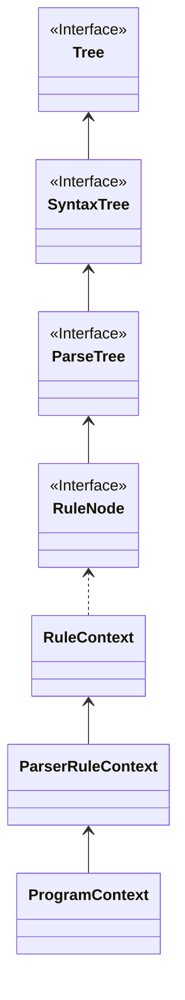
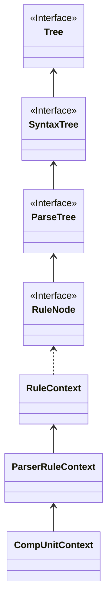
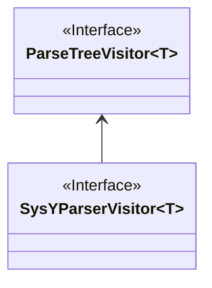

# SysYParser和ParseTree

ParseTree、ProgramContext、RuleNode都是从同一个类继承下来的，所以下面这行代码可以正确运行。

```java
ParseTree tree = sysYParser.program();
```

其中`sysYParser.program()`返回了一个`ProgramContext`对象，也就是语法分析器得到的抽象语法树的`Program`节点，与我们所写的词法规则对应。

`ParseTree`是抽象语法树的节点，`sysYParser`是词法分析器，两个并不具备包含关系。

<div style="page-break-after: always;"></div>

调用图如下：

- ProgramContext



<div style="page-break-after: always;"></div>

- CompUnitContext



<div style="page-break-after: always;"></div>

# Visitor的运行机制

- SysYParserVisitor



- Visitor模式需要定义两个类层次
	- Node层次：接受操作的元素（即第一部分的`Parsertree`）
	- Visitor层次：定义对元素的操作

在`Main`中我们通过这行命令调用`Visitor`遍历抽象语法树，`visitor`确实只是一个入口。

```java
visitor.visit(tree);
```

这个`tree`的声明类型是`ParseTree`，但显然它的实际类型是`ProgramContext`，所以这个语句会调用`SysyParser.ProgramContext`类中的`accept`。

注意：`ProgramContext`、`CompUnitContext`等类都是`SysyParser`内部的`static`类，因此`accept`方法并不能是`SysyParser`中的，而是每个抽象语法树的节点里的。

```java
@Override  
public <T> T accept(ParseTreeVisitor<? extends T> visitor) {  
	if ( visitor instanceof SysYParserVisitor ) 
		return ((SysYParserVisitor<? extends T>)visitor).visitProgram(this);  
	else 
		return visitor.visitChildren(this);  
}
```

这里的`if`判断`visitor`是否是`SysYParserVisitor`的实例，若是则进行类型转换，然后调用对应的`visit`方法。这里的`this`是`ProgramContext`，也就是抽象语法树的节点。这符合Visitor设计模式：accept以visitor为参数，节点内部实现accept时会回调visitor的的成员函数（以this为参数）。


`visitProgram`的原始定义在接口`SysYParserVisitor`中，`Antlr4`自动生成的类`SysYParserBaseVisitor`对其给出了默认实现。

```java
public class SysYParserBaseVisitor<T> extends AbstractParseTreeVisitor<T> implements SysYParserVisitor<T>
```

```java
public T visitProgram(SysYParser.ProgramContext ctx) { return visitChildren(ctx); }
```

`SysYParserBaseVisitor`中每个节点的`visitXXX`函数默认实现都是`visitChildren(ctx)`。

如果我们在本次Lab中使用Visitor模式，我们需要继承`SysYParserBaseVisitor`，所有这些方法都可以修改。因为本次Lab不需要对每个节点做特定处理，所以我们不需要修改每个节点的默认实现，只需要修改`visitChildren`就可以实现抽象语法树的打印。

`visitChildren`方法的存在只是为了具体实现时更方便，与Visitor设计模式关系不大。Visitor模式的核心应该是accept和visit的多分派，根据实际类型而不是声明类型来选择调用的方法（和C++中的虚函数类似）。

至于怎么打印语法树，也就是如何深度优先遍历，只要在我们自己的`visitChildren`中实现递归即可。其实可以参考`AbstractParseTreeVisitor`中的`visitChildren`，其中的`for`循环就实现了深度优先遍历，这里的`accept`也会根据`c`的实际类型动态选择实现，由于没有修改默认实现，最后一定会调用到`visitChildren`方法。  
我们只需要做一些修改，在适当的位置打印节点的相关信息就可以了。

```java
public T visitChildren(RuleNode node) {  
	T result = this.defaultResult();  
	int n = node.getChildCount();  
  
for(int i = 0; i < n && this.shouldVisitNextChild(node, result); ++i) {  
	ParseTree c = node.getChild(i);  
	T childResult = c.accept(this);  
	result = this.aggregateResult(result, childResult);  
}  
  
	return result;  
}
```
