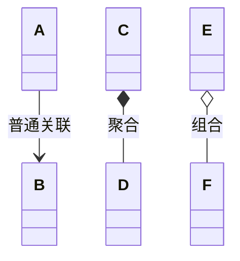

需求规格设计、体系结构设计$\Rightarrow$详细设计

# 面向对象

- 职责
- 协作

## 职责

包含数据和任务职责

## 协作

## 设计模型

### 抽象对象的职责

类表达了对对象族的本质特征的抽象
• 构建的蓝图
• 职责
• 数据职责
• ⾏为职责

### 抽象类之间关系

- 聚合：所属关系，被聚合的对象还可以被其他对象关联。
	- 学生与XX课程是聚合(菱形那边是整体)
- 组合：整体和包含，整体没了部分也没有;

信息专家：让能得到必要数据的类执行相应职责

- 顺序图
	- 同步消息 实心实线箭头
	- 异步消息 框实线箭头
	- 返回 虚线箭头

# 为类间协作开发集成测试⽤例

- 集成类间协作
- 使用Mock Object

# 结构化详细设计

- 按算法的分解
- 从数据流图向结构图的转换

# 详细设计⽂档描述和评审

- 验证：
	- 评审
	- 度量
		- 模块化度量
	- 测试
		- 协作测试

