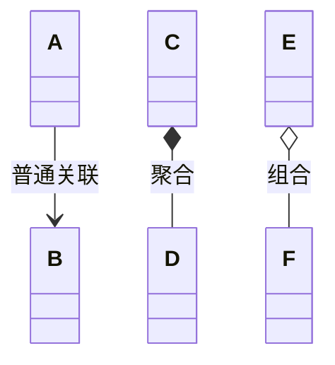

需求规格设计、体系结构设计$\Rightarrow$详细设计

# 面向对象

- 职责
- 协作

## 职责

包含数据和任务职责

## 协作

## 设计模型

### 抽象对象的职责

类表达了对对象族的本质特征的抽象
• 构建的蓝图
• 职责
• 数据职责
• ⾏为职责

### 抽象类之间关系

- 聚合：所属关系，被聚合的对象还可以被其他对象关联。
	- 学生与XX课程是聚合(菱形那边是整体)
- 组合：整体和包含，整体没了部分也没有;

信息专家：让能得到必要数据的类执行相应职责

