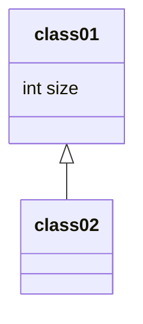
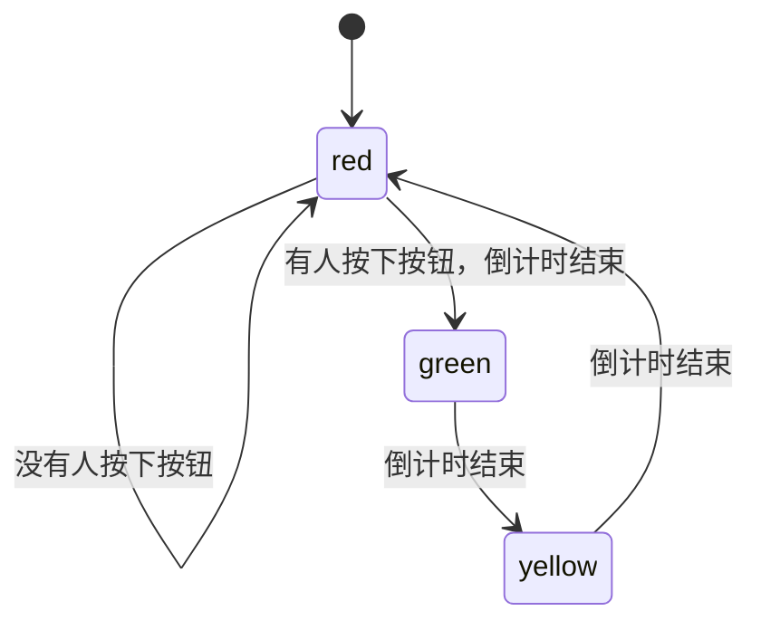

# 需求分析基础


## 需求分析模型与建模

### 手段
- 抽象（Abstraction）
- 分解（Decomposition / Partitioning)

### 常见分析模型:


# ⾯向对象分析

## 分析过程
涉及到过程都要记住


要形成需求描述的单元,即**契约**

## 用例

用例,<font color="#ff0000">是表达组织需求的方式</font>之一

- **用例**: 
	- [Jacobson1992]在系统(或者⼦系统或者类)和外部对象的<font color="#ff0000">交互</font>当中所执⾏的**⾏为序列**的描述,包括<font color="#ff0000">各种不同的序列和错误的序列</font>,它们能够联合提供⼀种<font color="#ff0000">有价值的服务</font>
	- [Cockburn2001]在不同条件下系统对某⼀⽤户的<font color="#ff0000">请求的响应</font>.根据⽤户的请求和请求时的系统条件,系统将执⾏不同的⾏为序列, 每⼀ 个⾏为序列被称为⼀个**场景**。⼀个⽤例是多个场景的集合.

- 特征:
	1. 内外交互
	2. 不同的行为序列
	3. 提供有价值的服务
	4. 结构化分析


### 案例
- 连锁超市管理系统的收银员为了完成⼀次销售任务,会使⽤软件系统处理销售过程,那么就可以建⽴⼀个⽤例“销售处理”。考虑实际销售时的不同条件,会发⽣不同的⾏为:
• 在⼀切顺利时是⼀种正常⾏为流程;
• 购买多个同样商品时可以逐⼀输⼊每个商品,也可以分别输⼊商品号与数量;
• 销售过程中可能会发现某个商品⽆法识别;```mermaid```mermaidclass Duck{
            +String beakColor
            +swim()
            +quack()
        }

flowchart LR
Start --> Stop
```


flowchart LR
Start --> Stop
```


• 有可能⼀个商品被纳⼊销售清单后⽤户⼜提出退回...... 
• 上述的每⼀个⾏为都是⼀个场景。所有的⾏为联合起来就构成了场景的集合——⽤例,它的
⽬标与价值是完成销售任务

### ⽤例图

**基本要素:**
1. 用例:椭圆
2. 参与者:小人
3. 关系:线
4. 系统边界:框

#### 参与者

判断:**有没有和系统交互**

1. 一个参与者可能表示多个用户
2. 一个系统可能有多个参与者
3. 不一定是人,也可能是外部系统
4. 一个用户可能有多个角色

#### 用例

Express requirements in the form of use cases.
• Use cases represent typical sets of scenarios that help to structure, relate 
and understand the essential requirements.
• Scenarios are descriptions of how a system is used in practice
• Typical interactions between a user and a computer system


#### 系统边界

Emphasis the focus on what is going to be detailed and what is not.
• The system boundary is implicitly existent in a diagram without an 
explicitly represented system boundary
• Actors are always outside the boundary and use cases are always inside 
the boundary.

#### 关系

- 不同参与者之间可以**泛化**(继承)
- include: group check-in 包含 individual check-in
- extend: baggage 泛化 individual


### 建立过程

1. ⽬标分析与解决⽅向的确定
2. 寻找参与者
3. 寻找⽤例
4. 细化⽤例
	- 如果⽤例的粒度不合适就需要进⾏细化和调整。
	- **判断标准**是：⽤例描述了为应对⼀个<font color="#ff0000">业务事件</font>，由⼀个⽤户发起，并在⼀ 个连续时间段内完成，可以增加业务价值的任务。


#### 常见错误

1. 不要将⽤例细化为单个操作
	- 例如,不要将⽤户管理细化为增加、修改和删除三个更⼩的⽤例,因为它们要联合起来才能体现出业务价值。
	- 不是所有用例都需要增删改查,例如有些业务下不能删除只能假删除
2. 不要将同⼀个业务⽬标细化为不同⽤例
	- 例如特价策略制定和赠送策略制定。
3. 不要将没有业务价值的内容作为⽤例
	- **常⻅的错误**有“登录”(应该描述为安全性 质量需求)、“数据验证”(应该描述为数据需求)、“连接数据库”(属性软件内部实现⽽不是需求)等。

#### 用例模板


- 超市收银系统销售
	- 参与者: 收营员(和系统交互),顾客给现金就不是参与者,直接扫码就是
	- 触发条件: 顾客拿着商品到收银台
	- 前置条件:收银员身份认证
	- 后置条件:系统产生数据
三个条件都可以为空

## 概念类图


类型方法可见性等复杂的软件细节不会出现

只有类名和属性,没有方法

关注系统与外界的交互而不是软件内部方法


基本元素


### 例子

ATM

显示屏

输入按键

读卡器

存款槽

打印机

客户
账户

存款、取款、查询余额->ATM
更新存款->Account Sys , with Pin

pin属于account,每个卡都对应一个密码





## 顺序图

- 分析阶段，主要是利⽤**系统顺序图**，<font color="#ff0000">表达系统和外部参与者之间的交互⾏为</font>

### 消息种类


### 系统循序图

同步消息是实现，三⻆箭头。
返回消息应该是虚线
Opt 是可选项
loop 是循环
alt 多选⼀


## 状态图

State: 
• a set of observable circumstances that characterizes the behavior of a system at a given time
• State transition: 
• the movement from one state to another
• Event: 
• an occurrence that causes the system to exhibit some predictable form of behavior
• Action: 
• process that occurs as a consequence of making a transition


### 建立状态图

1. 主体
   - 常见主体：类、⽤例、多个⽤例和整个系统
2. 识别状态
   - 状态主体会表现出⼀些稳定的状态，它们需要被识别出来，并且标记出其中的初始状态和结束状态集。在有些情 况下，可能会不存在确定的初始状态和结束状态
3. 建立转移
4. 完善
	- 添加转换的触发事件、转换⾏为和监护条件等详细信息


### 习题：红绿灯状态图

人行道



十字路口


