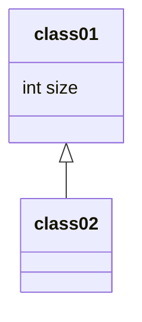
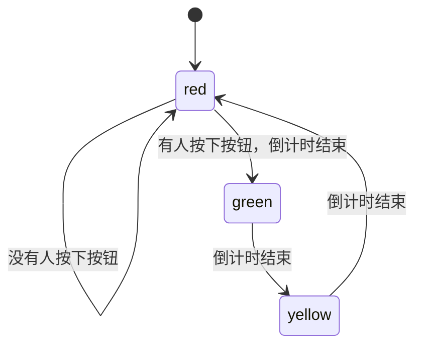

# 需求分析基础

## 需求分析模型与建模

### 手段
- 抽象（Abstraction）
- 分解（Decomposition / Partitioning)

### 常见分析模型:

# ⾯向对象分析

## 分析过程

涉及到过程都要记住

要形成需求描述的单元,即**契约**

## 用例

用例,是表达组织需求的方式之一

- **用例**: 
	- [Jacobson1992]在系统(或者⼦系统或者类)和外部对象的交互当中所执⾏的**⾏为序列**的描述,包括各种不同的序列和错误的序列,它们能够联合提供⼀种有价值的服务
	- [Cockburn2001]在不同条件下系统对某⼀⽤户的请求的响应.根据⽤户的请求和请求时的系统条件,系统将执⾏不同的⾏为序列, 每⼀ 个⾏为序列被称为⼀个**场景**。⼀个⽤例是多个场景的集合.

- 特征:
	1. 内外交互
	2. 不同的行为序列
	3. 提供有价值的服务
	4. 结构化分析

### 案例

- 连锁超市管理系统的收银员为了完成⼀次销售任务,会使⽤软件系统处理销售过程,那么就可以建⽴⼀个⽤例“销售处理”。考虑实际销售时的不同条件,会发⽣不同的⾏为:
- 在⼀切顺利时是⼀种正常⾏为流程;
- 购买多个同样商品时可以逐⼀输⼊每个商品,也可以分别输⼊商品号与数量;
- 销售过程中可能会发现某个商品⽆法识别;
- 有可能⼀个商品被纳⼊销售清单后⽤户⼜提出退回...... 
- 上述的每⼀个⾏为都是⼀个场景。所有的⾏为联合起来就构成了场景的集合——⽤例,它的⽬标与价值是完成销售任务

### ⽤例图

**基本要素:**
1. 用例:椭圆
2. 参与者:小人
3. 关系:线
4. 系统边界:框

#### 参与者

判断:**有没有和系统交互**

1. 一个参与者可能表示多个用户
2. 一个系统可能有多个参与者
3. 不一定是人,也可能是外部系统
4. 一个用户可能有多个角色

#### 用例

Express requirements in the form of use cases.
• Use cases represent typical sets of scenarios that help to structure, relate 
and understand the essential requirements.
• Scenarios are descriptions of how a system is used in practice
• Typical interactions between a user and a computer system

#### 系统边界

Emphasis the focus on what is going to be detailed and what is not.
• The system boundary is implicitly existent in a diagram without an 
explicitly represented system boundary
• Actors are always outside the boundary and use cases are always inside 
the boundary.

#### 关系

- 不同参与者之间可以**泛化**(继承)
- include: group check-in 包含 individual check-in
- extend: baggage 泛化 individual

### 建立过程

1. ⽬标分析与解决⽅向的确定
2. 寻找参与者
3. 寻找⽤例
4. 细化⽤例
	- 如果⽤例的粒度不合适就需要进⾏细化和调整。
	- **判断标准**是：⽤例描述了为应对⼀个业务事件，由⼀个⽤户发起，并在⼀ 个连续时间段内完成，可以增加业务价值的任务。

#### 常见错误

1. 不要将⽤例细化为单个操作
	- 例如,不要将⽤户管理细化为增加、修改和删除三个更⼩的⽤例,因为它们要联合起来才能体现出业务价值。
	- 不是所有用例都需要增删改查,例如有些业务下不能删除只能假删除
2. 不要将同⼀个业务⽬标细化为不同⽤例
	- 例如特价策略制定和赠送策略制定。
3. 不要将没有业务价值的内容作为⽤例
	- **常⻅的错误**有“登录”(应该描述为安全性 质量需求)、“数据验证”(应该描述为数据需求)、“连接数据库”(属性软件内部实现⽽不是需求)等。

#### 用例模板

- 超市收银系统销售
	- 参与者: 收营员(和系统交互),顾客给现金就不是参与者,直接扫码就是
	- 触发条件: 顾客拿着商品到收银台
	- 前置条件:收银员身份认证
	- 后置条件:系统产生数据
三个条件都可以为空

## 概念类图

- 类型方法可见性等复杂的软件细节不会出现
- 只有类名和属性,没有方法
- 关注系统与外界的交互而不是软件内部方法

### 基本元素

- 对象
	- 标示符
	- 状态
	- ⾏为
- 类
	- 对象集合的抽象
- 链接（link）（dependency）
	- 对象之间的互相协作的关系
	- 描述了对象之间的物理或业务联系
- 关联
	- 对象之间链接的抽象
	- 聚合与组合
- 继承
	- 泛化关系

### 关联与依赖

### 继承

### 建立概念类图

1. 对每个⽤例⽂本描述，尤其是场景描述，建⽴局部的概念类图
	- 根据⽤例的⽂本描述，识别候选类
	- 筛选候选类，确定概念类
	- 识别关联
	- 识别重要属性
2. 将所有⽤例产⽣的局部概念类图进⾏合并，建⽴软件系统的整体概念类图

#### 识别候选类

- 发现**软件系统与外界交互**时可能涉及的对象与类，它们就是候选类
- ⾏为分析、名词分析、CRC等很多种⽅法都可以⽤来分析⽤例⽂本描述

#### 确定概念类

- 依据系统的需求
- 该类的对象实例的状态与⾏为是否完全必要

- 从候选类向概念类转化:
	- 既需要维持⼀定的状态，⼜需要依据状态表现⼀定的⾏为
		- 概念类
	- 只需要维护状态，不需要表现⾏为
		- 其他概念类的属性
	- 不需要维护状态，却需要表现⾏为
		- 需求是否遗漏,没有状态⽀持的对象⽆法表现⾏为
	- 不需要维护状态，⼜不需要表现⾏为
		- 剔除

#### 识别关联

- 在需要协作的概念类之间建立关联
- 分析和补充问题域内的关系，例如概念类之间的整体部分关系和明显的语义联系。
	- 对问题域关系的补充要适可⽽⽌，不要把关系搞得过度复杂化。
- 去除冗余关联和导出关联。

#### 识别重要属性

- 这些属性往往是实现类协作时必要的信息，是协作的条件、输⼊、结果或者过程记录。
- 通过分析⽤例的描述，并与⽤户交流，补充问题域信息，可以发现重要的属性信息。
- 在分析每个单独的⽤例（场景）描述时，为各个概念类发现的重要属性可能不多，甚⾄有些概念类没有任何重要属性。但是，系统通常有多个⽤例和很多场景，会建⽴多个局部的概念类图，只有在合并所有局部概念类图之后，各个概念类的重要属性才能得到全⾯的体现。

### 例子

- University Bank will be opening in Oxford, Mississippi, in January, 2000. We plan to use a full service automated teller machine (ATM) system.The ATM system will interact with the customer through a display screen, numeric and special input keys, a bankcard reader, a deposit slot, and a receipt printer.Customers may make deposits, withdrawals, and balance inquires using the ATM machine, but the update to accounts will be handled through an interface to the Accounts system.Customers will be assigned a Personal Identification Number (PIN) and clearance level by the Security system. The PIN can be verified prior to any transaction.In the future, we would also like to support routine operations such as a change of address or phone number using the ATM

ATM

显示屏

输入按键

读卡器

存款槽

打印机

客户
账户

存款、取款、查询余额->ATM
更新存款->Account Sys , with Pin

pin属于account,每个卡都对应一个密码

## 顺序图

- 分析阶段，主要是利⽤**系统顺序图**，表达系统和外部参与者之间的交互⾏为

### 消息种类

### 系统顺序图

同步消息是实现，三⻆箭头。
返回消息应该是虚线

Opt 是可选项
loop 是循环
alt 多选⼀

## 状态图

- State: 
	- a set of observable circumstances that characterizes the behavior of a system at a given time
- State transition: 
	- the movement from one state to another
- Event: 
	- an occurrence that causes the system to exhibit some predictable form of behavior
- Action: 
	- process that occurs as a consequence of making a transition

### 建立状态图

1. 主体
   - 常见主体：类、⽤例、多个⽤例和整个系统
2. 识别状态
   - 状态主体会表现出⼀些稳定的状态，它们需要被识别出来，并且标记出其中的初始状态和结束状态集。在有些情 况下，可能会不存在确定的初始状态和结束状态
3. 建立转移
4. 完善
	- 添加转换的触发事件、转换⾏为和监护条件等详细信息

## 习题：红绿灯状态图

人行道

十字路口

## 习题：ATM机

# 结构化分析方法

## 思想

- 自顶向下
- 图
	- 数据流图
	- 实体关系图
	- 状态转移图

## 数据流图

- 把系统看作**过程**的集合
- 过程：
	- 对数据的处理
	- 接收输⼊，进⾏数据转换，输出结果
- 数据变化：
	- 被转换、被存储、或者被分布

### 基本元素

#### 外部实体

消费者

- 不受系统控制，可能是系统之外的人、设备、组织、其他全歼系统等
- 与系统产生数据交互，为数据提供者或目的地

### 过程

- 数据处理行为

### 数据流

- 数据运动

### 语法规则

1. 过程是对数据的处理，必须有输⼊，也必须有输出，输⼊数据集应该和输出 数据集存在差异。
2. 数据流是必须和过程产⽣关联的，它要么是过程的数据输⼊，要么是过程的数据输出。
3. 所有的对象都应该有⼀个可以唯⼀标示⾃⼰的名称。

### 分层结构

- 上下文图
- 0层图
- ...
- N层图

#### 0层图

- 数据交互
- 外部实体

### 1层图

### 过程分解的平衡原则

子图的输入流、输出流必须和父过程的一致

## 实体关系图（ERD）

- 数据建模
- 把数据看成数据对象

### 数据对象

### 关系

### 建立实体关系图

- Level 1—model all data objects (entities) and their “connections” to one another
- Level 2—model all entities and relationships
- Level 3—model all entities, relationships, and the attributes that provide further depth

### 键（Key）

- 实体的⼀个或者多个属性能够唯⼀确定和标示每个实例，这些属性或者属性 组合就被称为实体的标示符，或者键（Key）

# 使⽤需求分析⽅法细化和明确需求

## 细化和明确需求

- 为什么要细化
	- ⽤户需求的描述的模糊性和系统设计所需要的严谨性之间的⽭盾
- 如何细化
	- 需求分析建模
	- 发现其中的遗漏、冲突、冗余和错误
	- 迭代（获取、分析、获取、分析。。。）

- 系统顺序图有助于发现交互性缺失

- 概念类图有助于发现
	- 部分信息使用不准确
	- 部分信息不明确
	- 遗漏重要内容

- 状态图有助于发现界⾯的跳转

## 建立系统需求

IEEE规定8种方法

正常流程可以写循环，分支写到扩展流程里

- 规格说明：
	- 只是罗列，没有顺序
	- 一个刺激对于一个响应

先写用例文档和各种分析图，下周二交（4.11）
概念类图（基本上每个用例都要画，最后合成一个）
系统顺序图（描述复杂交互）
状态图（复杂状态变化）

