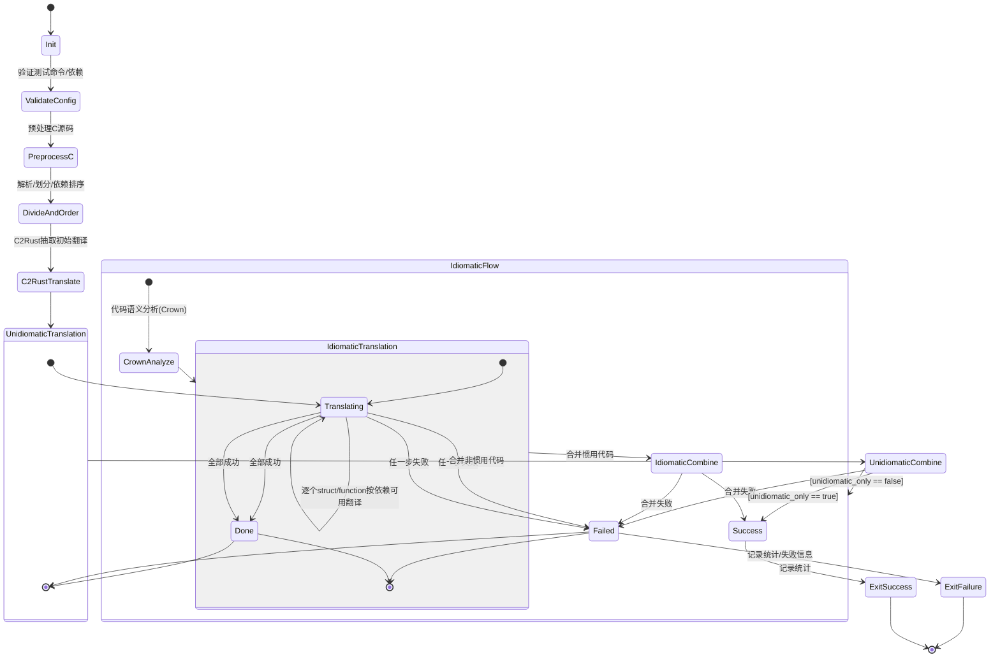

# LLM-Driven Multi-step Translation from C to Rust using Static Analysis

## 流程

- 流程
	1. 任务划分
	2. 代码转译
		1. 先生成unsafe代码，然后用LLM修改为safe代码

### Unidiomatic代码生成

C2Rust： 只做变量类型转换，用LLM处理全局变量和函数  
C parser: 提取依赖信息，作为LLM的上下文信息

### Idiomatic代码生成

重点在于处理指针和其他unsafe blocks，用rust types代替

Crown：分析指针

### 验证

Unidiomatic代码验证

Idiomatic代码验证

反馈机制

## 代码架构

### 整体架构

输入C代码 → 预处理 → C解析 → 依赖分析 → 翻译 → 组合 → 验证 → 输出Rust代码

### ThirdParty

对c2rust，crown，rustfmt工具做python封装

