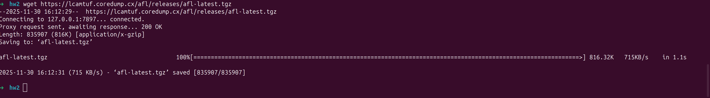
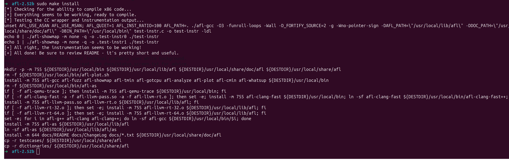
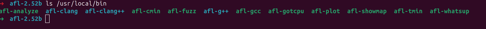
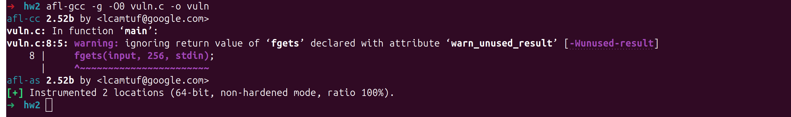
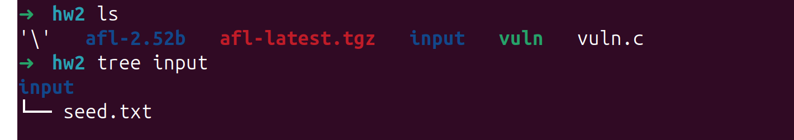
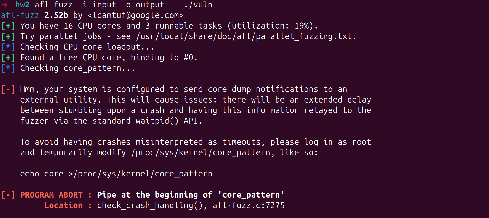
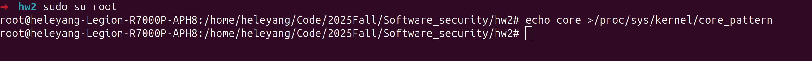
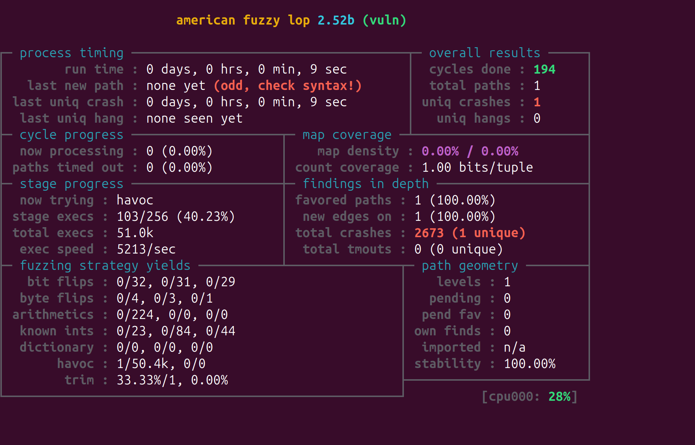
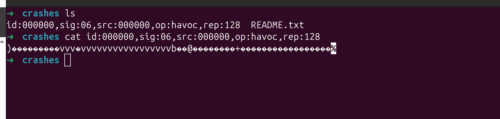

## 第二次实验


## 题目描述


使用 American Fuzzy Lop (http://lcamtuf.coredump.cx/afl/) 工具挖掘 C/C++ 程序 漏洞。完成实验报告。


## 实验过程


### 1. 安装 American Fuzzy Lop









### 2. 编写测试用例


```c
#include <stdio.h>
#include <string.h>

int main() {
    char buf[16];
    char input[256];

    fgets(input, 256, stdin);
    strcpy(buf, input);  // 可能溢出
    printf("Received: %s\n", buf);

    return 0;
}

```


### 3. 编译插桩版本




### 4. 准备测试数据





### 5. 执行afl


- 出现报错，按照提示修改：







- 启动后进入afl ui:




- 查看引起crash的测试用例



