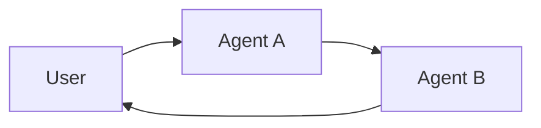

根据LangChain官方文档，Agent通信方式主要包含以下几种模式：

# **1. 工具调用通信（Tool Calling）**

**核心概念**：一个主Agent（控制器）通过调用其他Agent作为工具来实现通信。这是最常见的多Agent协调方式。

```python
from langchain.tools import tool
from langchain.agents import create_agent

# 创建子Agent
subagent1 = create_agent(model="...", tools=[...])

# 定义工具包装子Agent
@tool(
    "subagent1_name",
    description="Handles data analysis tasks"
)
def call_subagent1(query: str):
    result = subagent1.invoke({
        "messages": [{"role": "user", "content": query}]
    })
    return result["messages"][-1].content

# 主Agent使用工具
agent = create_agent(model="...", tools=[call_subagent1])
```

**特点**：
- 中央控制：所有路由都通过调用Agent完成
- 单向通信：子Agent不直接与用户交互
- 适用场景：任务编排、结构化工作流

# **2. 握手交接通信（Handoffs）**

**核心概念**：一个Agent可以直接将控制权传递给另一个Agent。活跃的Agent会改变，用户可能会直接与新Agent交互。



**特点**：
- 分散控制：Agent可以改变谁处于活跃状态
- 直接交互：用户可以继续与当前Agent交互
- 适用场景：多域对话、专家接管

# **3. 子图调用通信（Subgraph Invocation）**

**不同状态的子图**（完全隔离）：

```python
from langgraph.graph.state import StateGraph, START

# 子图（不同状态）
class SubgraphState(TypedDict):
    bar: str

def subgraph_node_1(state: SubgraphState):
    return {"bar": "hi! " + state["bar"]}

subgraph_builder = StateGraph(SubgraphState)
subgraph_builder.add_node(subgraph_node_1)
subgraph_builder.add_edge(START, "subgraph_node_1")
subgraph = subgraph_builder.compile()

# 父图中调用
class ParentState(TypedDict):
    foo: str

def call_subgraph(state: ParentState):
    # 状态转换
    subgraph_output = subgraph.invoke({"bar": state["foo"]})
    return {"foo": subgraph_output["bar"]}

builder = StateGraph(ParentState)
builder.add_node("node_1", call_subgraph)
builder.add_edge(START, "node_1")
graph = builder.compile()
```

**共享状态的子图**（直接集成）：

```python
# 父图和子图共享状态
class State(TypedDict):
    foo: str

# 子图
subgraph_builder = StateGraph(State)
subgraph_builder.add_node("subgraph_node_1", lambda state: {"foo": "hi! " + state["foo"]})
subgraph_builder.add_edge(START, "subgraph_node_1")
subgraph = subgraph_builder.compile()

# 父图直接添加子图作为节点
builder = StateGraph(State)
builder.add_node("node_1", subgraph)  # 子图作为节点
builder.add_edge(START, "node_1")
graph = builder.compile()
```

**特点**：
- 灵活的状态管理：可以共享或隔离
- 代码复用：子图可在多个父图中使用
- 团队开发：不同团队可独立开发子图

# **4. 共享内存通信（Shared State/Messages）**

**消息共享**：多个Agent通过共享的消息历史通信

```python
from typing_extensions import TypedDict
from typing import Annotated
from langgraph.graph.message import add_messages

class AgentState(TypedDict):
    messages: Annotated[list, add_messages]  # 共享消息频道

# 所有Agent可访问和修改messages
def agent_node(state: AgentState):
    # 读取消息历史
    response = model.invoke(state["messages"])
    # 添加新消息
    return {"messages": [response]}
```

# **5. 工具中调用子图通信**

**隔离状态的关键方案**：给每个图自己的检查点存储

```python
from langgraph.checkpoint.memory import MemorySaver
from langchain_core.tools import tool

# 子图B有自己的检查点
checkpointer_b = MemorySaver()  # 独立的检查点
graph_b = StateGraph(GraphBState)
# ... 添加节点 ...
graph_b = graph_b.compile(checkpointer=checkpointer_b)

# 工具中调用子图
@tool
def call_graph_b(query: str, config: RunnableConfig) -> str:
    """Call Graph B subagent."""
    thread_id = config.get("configurable", {}).get("thread_id")
    # 使用相同的thread_id但不同的检查点保持状态隔离
    result = graph_b.invoke(
        {"messages": [HumanMessage(content=query)]},
        {"configurable": {"thread_id": thread_id}}
    )
    return f"Response from Graph B"

# 主Agent
checkpointer_a = MemorySaver()  # 独立的检查点
agent = create_react_agent(
    model=ChatAnthropic(model="claude-sonnet-4-20250514"),
    tools=[call_graph_b],
    checkpointer=checkpointer_a,
)
```

# 6. A2A协议

# **7. 多Agent系统架构选择**

| 通信方式 | 控制流 | 使用场景 | 用户交互 |
|---------|------|--------|---------|
| **工具调用** | 中央控制 | 任务编排、结构化流程 | 仅与主Agent交互 |
| **握手交接** | 分散控制 | 多域对话、专家接管 | 与当前Agent交互 |
| **子图调用** | 层级控制 | 代码复用、团队分工 | 通过主图间接交互 |
| **消息共享** | 对称通信 | 协作讨论、多视角分析 | 通过共享状态交互 |

# **核心概念：上下文工程（Context Engineering）**

多Agent系统的质量关键在于**正确的上下文工程**：

- **信息过滤**：每个Agent只看到相关信息
- **提示定制**：为不同Agent提供专门的提示
- **状态隔离**：防止不相关的数据污染
- **输出控制**：格式化返回给其他Agent的数据

**相关文档**：

- [多Agent系统指南](https://docs.langchain.com/oss/python/langchain/multi-agent)
- [子图使用指南](https://docs.langchain.com/oss/python/langgraph/use-subgraphs)
- [工具定义指南](https://docs.langchain.com/oss/python/langchain/tools)
- [子图状态隔离方案](https://support.langchain.com/articles/6131002418-isolating-subgraph-state-when-calling-graphs-from-tools)
- [A2A endpoint in Agent Server - Docs by LangChain](https://docs.langchain.com/langsmith/server-a2a)
- [A2A Protocol](https://a2a-protocol.org/latest/)