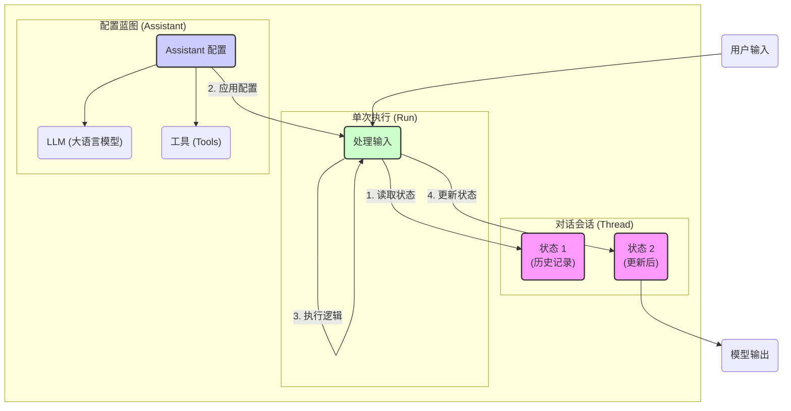

- Graph API
- Agents
- Tools
- Middleware

# 核心概念：Thread, Assistant, Run

LangGraph 通过三个核心概念来管理和执行有状态的 AI 应用：`Thread`（线程）、`Assistant`（助理）和 `Run`（运行）。

## Thread (线程)

`Thread` 是一个独立的、持久化的对话会话容器，用于存储特定对话的所有上下文和历史状态，是实现状态管理的核心。

-   **核心作用**：保存和管理状态 (`state`)。这个状态不仅包括对话历史，还可以是中间计算结果、Agent的下一步计划等。
-   **持久化**：`Thread` 的状态是持久的，即使应用重启，也能从上次中断的地方无缝恢复会话。
	- `graph`中每个节点都是一个`super-step`
	- `checkpointer`会保存每个`super-step`的`checkpoint`，包含该`node`的元数据和状态
	- `checkpoint`的集合组成`thread`
-   **主要用途**：
    1.  **多轮对话**：为每个用户或每个对话创建一个 `Thread`，实现上下文理解。
    2.  **长时任务**：保存复杂任务的每一步进度，支持任务中断和恢复。
    3.  **用户隔离**：在多用户应用中，每个用户的 `Thread` 互相隔离，保证数据安全和个性化体验。

![[assets/Pasted image 20251208174750.png]]
### 管理 Thread

通过 `langgraph_sdk` 可以管理 `Thread`：
-   `client.threads.create()`：创建一个新的空 `Thread`，或从现有 `Thread` 复制。
-   `client.threads.search()`：根据 `status` (状态) 或 `metadata` (元数据) 筛选和列出 `Thread`。
-   `client.threads.get()`：获取特定 `Thread` 的元数据。
-   `client.threads.get_state()`：查看 `Thread` 的当前状态。
-   `client.threads.get_history()`：查看 `Thread` 的完整历史状态记录。

## Assistant (助理)

`Assistant` 是一个无状态的配置单元。它定义了 AI 应用的行为逻辑，但本身不存储任何会话状态。这使得逻辑和数据可以完全分离。
ba
-   **核心作用**：定义**如何处理**一次交互，包括：
    -   **模型 (LLM)**：使用哪个大语言模型。
    -   **工具 (Tools)**：授权 Agent 可以调用哪些工具。
    -   **指令 (Prompts)**：系统的核心指令和行为准则。
-   **特性**：
    -   **可复用**：同一个 `Assistant` 可以被应用在无数个不同的 `Thread` 上。
    -   **版本化**：可以为 `Assistant` 创建不同版本，方便进行 A/B 测试或功能迭代，而无需改动底层代码。
    -   **动态更新**：可以在不重新部署代码的情况下，通过 API 或 UI 更新 `Assistant` 的配置。
-   **应用场景**：
    -   **A/B 测试**：创建两个使用不同模型或 Prompt 的 `Assistant` 版本，测试哪个效果更好。
    -   **多租户/多环境**：为不同的客户或开发/生产环境配置不同的 `Assistant`。

## Run (运行)

`Run` 代表一次具体的执行过程，负责集成 `Thread` 和 `Assistant`。当用户在一个会话 (`Thread`) 中发起新的请求时，就会触发一个 `Run`。

-   **核心作用**：`Run` 负责执行一次完整的“读取 -> 处理 -> 更新”循环。
    1.  **结合**：将一个 `Assistant`（行为逻辑）和一个 `Thread`（历史状态）绑定在一起。
    2.  **执行**：接收用户输入，加载 `Thread` 的当前状态，应用 `Assistant` 的配置来处理请求。
    3.  **更新**：执行完毕后，将新的状态（如模型的回复、工具的调用结果）写回 `Thread` 中。

---
**参考链接:**
- [LangSmith Docs: Use threads](https://docs.langchain.com/langsmith/use-threads)
- [LangSmith Docs: Assistants](https://docs.langchain.com/langsmith/assistants)