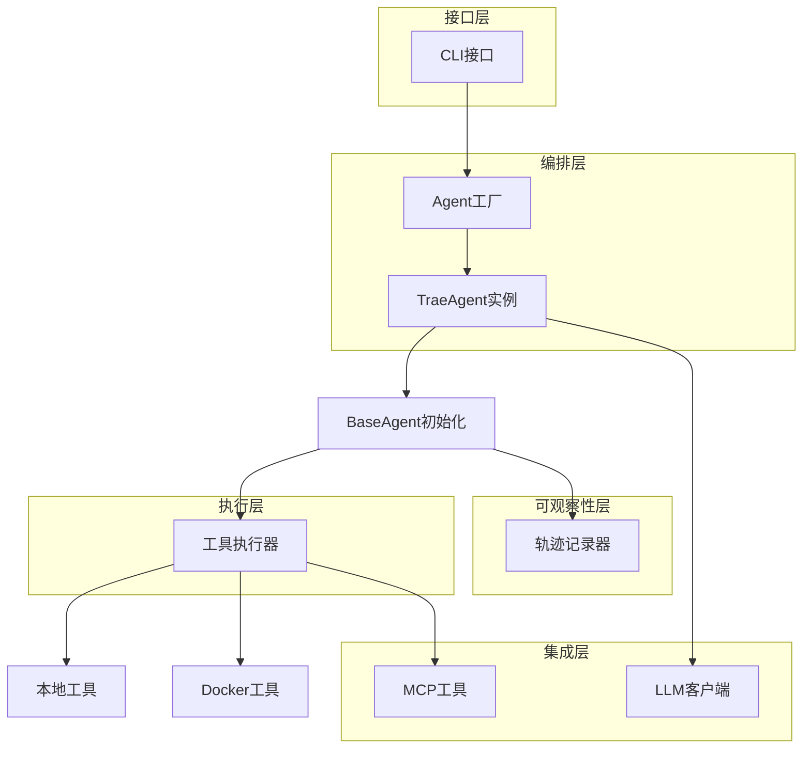

# Trae-agent

Trae Agent是一个基于LLM的、用于通用软件工程任务的自主代理系统。它接受自然语言描述的任务，通过迭代式、由LLM驱动的决策来协调多种工具以执行任务。

## 架构特点

Trae Agent采用模块化、分层的架构设计，优先考虑透明性、可扩展性、可复现性和灵活性。

1.  **模块化设计**: 各组件职责清晰，易于扩展和维护。支持对代理行为、工具实现和LLM提供商进行修改。
2.  **多LLM支持**: 通过统一的`LLMClient`抽象，支持7家LLM提供商（OpenAI, Anthropic, Google Gemini, Azure OpenAI, Ollama, OpenRouter, Doubao）。
3.  **容器化执行**: 支持在Docker容器中隔离执行工具，可通过镜像名称、Dockerfile或容器ID进行初始化，提高了安全性和可复现性。
4.  **动态工具发现**: 通过模型上下文协议（MCP）支持在运行时从外部服务器动态发现工具，扩展了代理的能力。
5.  **完整轨迹记录**: `TrajectoryRecorder`会捕捉完整的执行轨迹，包括LLM交互、代理步骤和元数据，便于调试和分析。`Lakeview`提供可选的步骤摘要。
6.  **灵活配置**: 配置遵循一个优先级级联：CLI参数 > YAML文件 > 环境变量 > 默认值。

## 核心架构组件

系统包含多个层次，包括接口层（用户交互）、编排层（任务执行）、集成层（外部服务）、执行层（工具调用）和可观察性层（日志和反馈）。

### 1. Agent层次结构

-   **BaseAgent**: 抽象基类，实现了通用的代理循环，并提供LLM客户端、工具管理和轨迹记录等核心功能。
-   **TraeAgent**: 继承自`BaseAgent`，专门为软件工程任务进行编排和优化，支持MCP集成。
-   **Agent**: 工厂类，负责根据配置创建和初始化不同类型的agent实例。

### 2. 工具生态系统

-   **ToolExecutor**: 本地工具执行器，管理在本地环境执行的内置工具。
-   **DockerToolExecutor**: 在Docker环境中执行工具的执行器，负责容器化工具的生命周期。
-   **核心工具**:
    -   `bash`: 执行shell命令。
    -   `TextEditorTool`: 用于读写和编辑文件。
    -   `SequentialThinkingTool`: 引导LLM进行结构化思考。
    -   `TaskDoneTool`: 标志任务完成。
    -   `JSONEditTool`: 用于编辑JSON文件。
-   **MCP集成**: 支持模型上下文协议（Model Context Protocol），可以动态发现并集成外部工具服务。

### 3. 配置管理

-   **Config**: 顶层配置类，管理所有组件的配置。
-   **TraeAgentConfig**: Trae Agent专用配置，包含工具列表、MCP服务器配置等。
-   **MCPServerConfig**: MCP服务器配置，支持stdio、SSE、HTTP、WebSocket等多种传输方式。
-   配置加载遵循**CLI参数 > YAML文件 > 环境变量 > 默认值**的优先级顺序。

### 4. Docker支持

-   **DockerManager**: 负责管理Docker容器的整个生命周期，支持通过镜像、容器ID、Dockerfile等多种方式启动容器。
-   功能包括工作目录挂载、工具二进制文件复制、主机与容器间的路径转换等。

### 5. 可观察性与轨迹记录

-   **TrajectoryRecorder**: 记录LLM的每一次交互和agent的执行步骤，自动保存输入消息、模型响应、工具调用、执行结果等详细信息，用于调试和分析。
-   **Lakeview**: 提供一个可选的步骤摘要功能，用于快速概览任务执行过程。

## 工作流程



### trae-cli

`trae-cli`是与Agent交互的主要入口，提供运行任务、进行交互式会话、显示配置和列出可用工具等功能。

1.  `trae-cli`解析命令行参数，创建Agent实例。

```python
    agent = Agent(
        agent_type,
        config,
        trajectory_file,
        cli_console,
        docker_config=docker_config,
        docker_keep=docker_keep,
    )
```

2.  `trae-cli`启动异步任务来执行指定的任务。

```python
_ = asyncio.run(agent.run(task, task_args))
```

### Agent工厂类

1.  根据`agent_type`构造具体的Agent实现类。

```python
match self.agent_type:
    case AgentType.TraeAgent:
        if config.trae_agent is None:
            raise ValueError("trae_agent_config is required for TraeAgent")
        from .trae_agent import TraeAgent

        self.agent_config: AgentConfig = config.trae_agent
        self.agent: TraeAgent = TraeAgent(
        self.agent_config, docker_config=docker_config, docker_keep=docker_keep)
```

2.  初始化待执行的新任务、初始化MCP，并最终执行任务。

```python
// Trae Agent将待执行的任务抽象为task
self.agent.new_task(task, extra_args, tool_names)
// 执行创建的task
execution = await self.agent.execute_task()
```

## 开发与测试

项目使用现代化的Python工具链，如`uv`进行包管理，`pytest`进行测试，`ruff`进行代码格式化和检查。测试用例通过标记（`unit`, `integration`, `slow`）进行分类，并通过GitHub Actions进行CI/CD。
