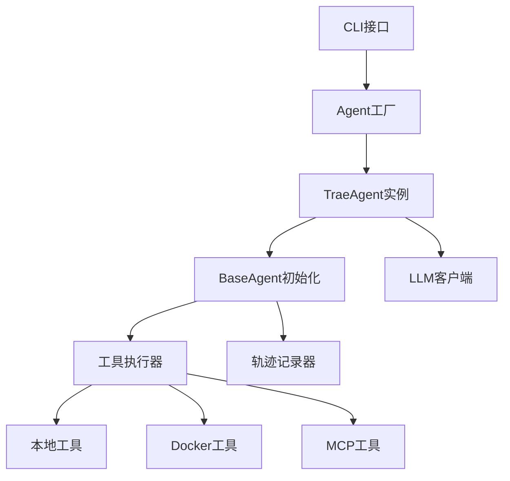

# Trae-agent

Trae Agent是一个基于LLM的软件工程任务代理系统，采用模块化、可扩展的架构设计。

## 架构特点

1. **模块化设计**: 各组件职责清晰，易于扩展和维护
2. **多LLM支持**: 支持OpenAI、Anthropic、Google Gemini等多种LLM提供商
3. **容器化执行**: 支持Docker环境隔离执行，提高安全性和可重现性
4. **动态工具发现**: 通过MCP协议支持运行时发现外部工具
5. **完整轨迹记录**: 提供详细的执行日志，便于调试和分析
6. **灵活配置**: 支持YAML配置文件和环境变量覆盖

## 核心架构组件

### 1. Agent层次结构

- **BaseAgent**: 抽象基类，提供LLM客户端、工具管理和轨迹记录等核心功能
- **TraeAgent**: 继承BaseAgent，专门针对软件工程任务优化，支持MCP集成
- **Agent**: 工厂类，负责创建和配置不同类型的agent实例

### 2. 工具执行系统

- **ToolExecutor**: 本地工具执行器，管理内置工具的执行
- **DockerToolExecutor**: Docker环境工具执行器，支持容器化工具执行
- **MCP集成**: 支持Model Context Protocol，动态发现外部工具服务

### 3. 配置管理

- **Config**: 顶层配置类，管理所有组件配置
- **TraeAgentConfig**: Trae Agent专用配置，包含工具列表、MCP服务器配置等
- **MCPServerConfig**: MCP服务器配置，支持stdio、SSE、HTTP、WebSocket等多种传输方式

### 4. Docker支持

- **DockerManager**: 管理Docker容器生命周期，支持镜像、容器ID、Dockerfile等多种启动方式
- 支持工作目录挂载、工具二进制文件复制、路径翻译等功能

### 5. 轨迹记录系统

- **TrajectoryRecorder**: 记录LLM交互和agent执行步骤，支持调试和分析
- 自动记录输入消息、响应、工具调用、执行结果等详细信息

## 工作流程

