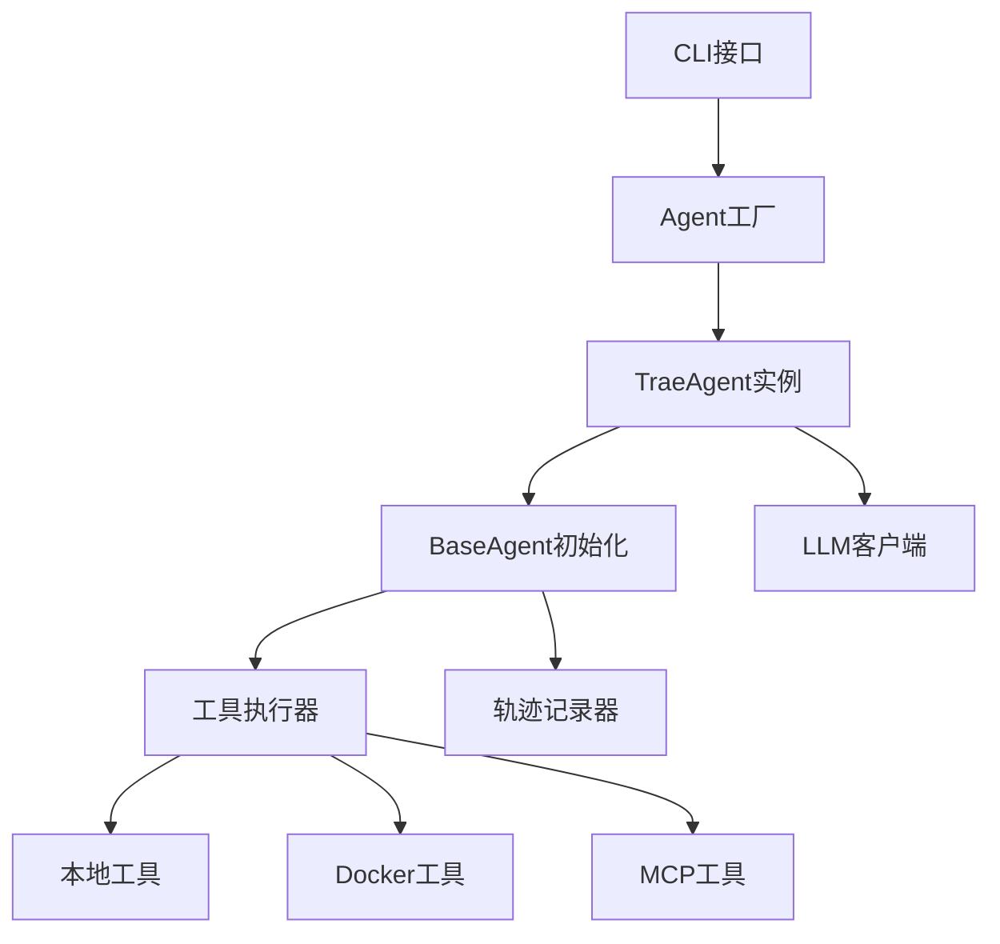

# Trae-agent

Trae Agent是一个基于LLM的软件工程任务代理系统，采用模块化、可扩展的架构设计。

[Search \| DeepWiki](https://deepwiki.com/search/trae-agent_1b601bed-e58d-4174-b16a-2dd1dd7d9111)

## 架构特点

1. **模块化设计**: 各组件职责清晰，易于扩展和维护
2. **多LLM支持**: 支持OpenAI、Anthropic、Google Gemini等多种LLM提供商
3. **容器化执行**: 支持Docker环境隔离执行，提高安全性和可重现性
4. **动态工具发现**: 通过MCP协议支持运行时发现外部工具
5. **完整轨迹记录**: 提供详细的执行日志，便于调试和分析
6. **灵活配置**: 支持YAML配置文件和环境变量覆盖

## 核心架构组件

### 1. Agent层次结构

- **BaseAgent**: 抽象基类，提供LLM客户端、工具管理和轨迹记录等核心功能
- **TraeAgent**: 继承BaseAgent，专门针对软件工程任务优化，支持MCP集成
- **Agent**: 工厂类，负责创建和配置不同类型的agent实例

### 2. 工具执行系统

- **ToolExecutor**: 本地工具执行器，管理内置工具的执行
- **DockerToolExecutor**: Docker环境工具执行器，支持容器化工具执行
- **MCP集成**: 支持Model Context Protocol，动态发现外部工具服务

### 3. 配置管理

- **Config**: 顶层配置类，管理所有组件配置
- **TraeAgentConfig**: Trae Agent专用配置，包含工具列表、MCP服务器配置等
- **MCPServerConfig**: MCP服务器配置，支持stdio、SSE、HTTP、WebSocket等多种传输方式

### 4. Docker支持

- **DockerManager**: 管理Docker容器生命周期，支持镜像、容器ID、Dockerfile等多种启动方式
- 支持工作目录挂载、工具二进制文件复制、路径翻译等功能

### 5. 轨迹记录系统

- **TrajectoryRecorder**: 记录LLM交互和agent执行步骤，支持调试和分析
- 自动记录输入消息、响应、工具调用、执行结果等详细信息

## 工作流程



### trae-cli

1. trae-cli解析命令行参数，创建Agent实例

```python
    agent = Agent(
        agent_type,
        config,
        trajectory_file,
        cli_console,
        docker_config=docker_config,
        docker_keep=docker_keep,
    )
```

2. trae-cli启动异步任务

```python
_ = asyncio.run(agent.run(task, task_args))
```

### agent工厂类

1. 根据agent_type构造具体Agent是实现类

```python
match self.agent_type:
    case AgentType.TraeAgent:
        if config.trae_agent is None:
            raise ValueError("trae_agent_config is required for TraeAgent")
        from .trae_agent import TraeAgent

        self.agent_config: AgentConfig = config.trae_agent
        self.agent: TraeAgent = TraeAgent(
        self.agent_config, docker_config=docker_config, docker_keep=docker_keep)
```

2. 初始化待执行的新任务
3. 初始化MCP
4. 执行任务

```python
// Trae Agent把待执行的任务抽象为task
self.agent.new_task(task, extra_args, tool_names)
// 执行创建的task
execution = await self.agent.execute_task()
```

# 日志记录

[Search \| DeepWiki](https://deepwiki.com/search/llm-agent_9d0d1871-c8ba-4b35-a5ce-ff97a64d5066?mode=fast)