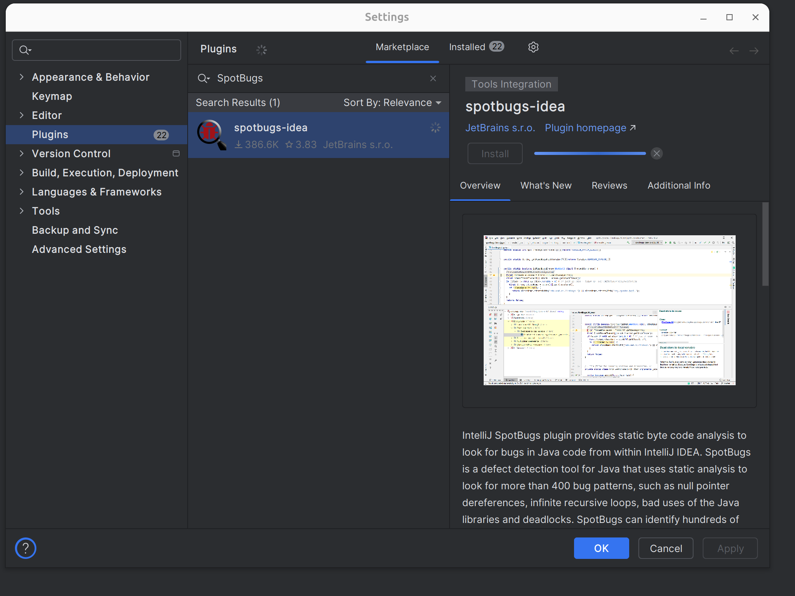
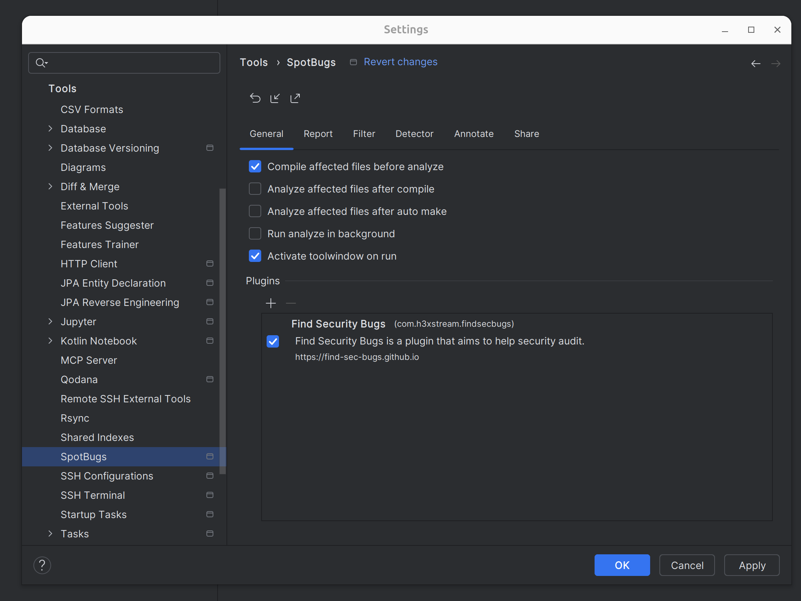
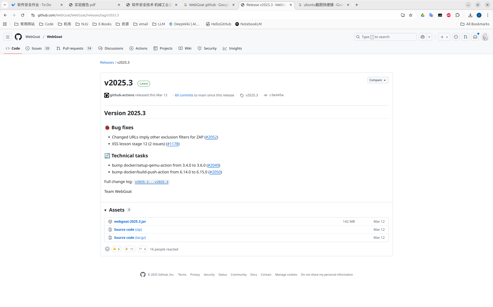
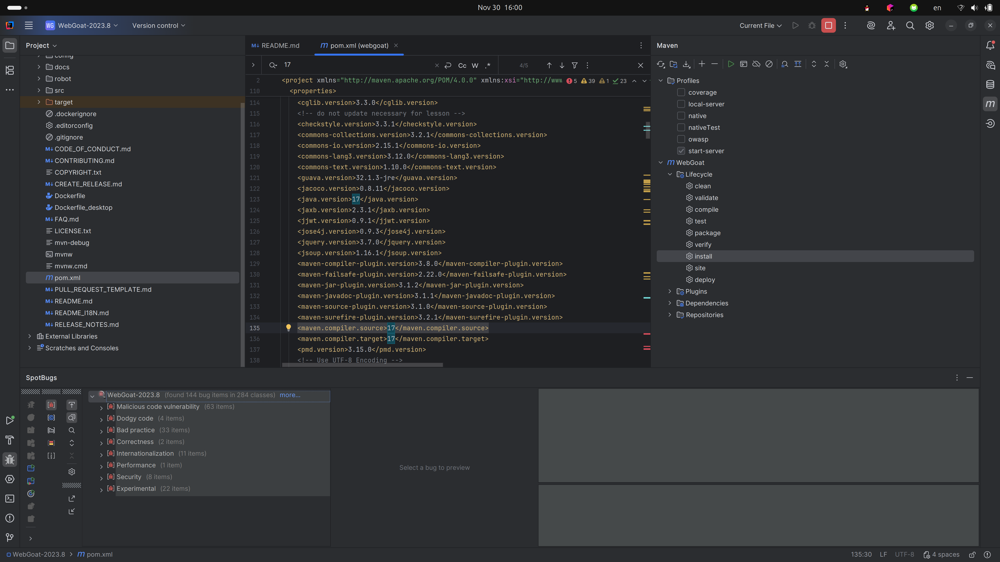

# 第一次实验

## 题目

用 Find Security Bugs (http://find-sec-bugs.github.io) 工具静态分析 WebGoat。WebGoat 是 OWASP 组织研制出的用于进行 Web 漏洞实验的应用平台，官方网址是http: //www.owasp.org.en/owasp-project/webscan-platform。WebGoat 运行在带有 Java 虚拟机的平台之上，当前提供的训练课程有 30 多个，其中包括：跨站点脚本攻击 (XSS)、 访问控制、线程安全、操作隐藏字段、操纵参数、弱会话 Cookie、SQL 盲注、数字型 SQL 注入、宇符串型 SQL 注入和 Web 服务等。完成实验报告

# 实验过程

## 1. 安装Find Security Bugs插件，配置规则库

## 2. 下载WebGoat源码

## 3. 执行SpotBugs静态分析

